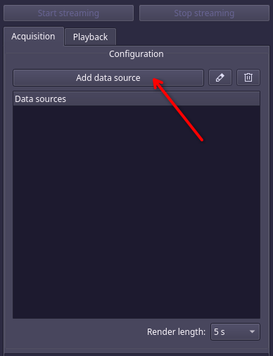
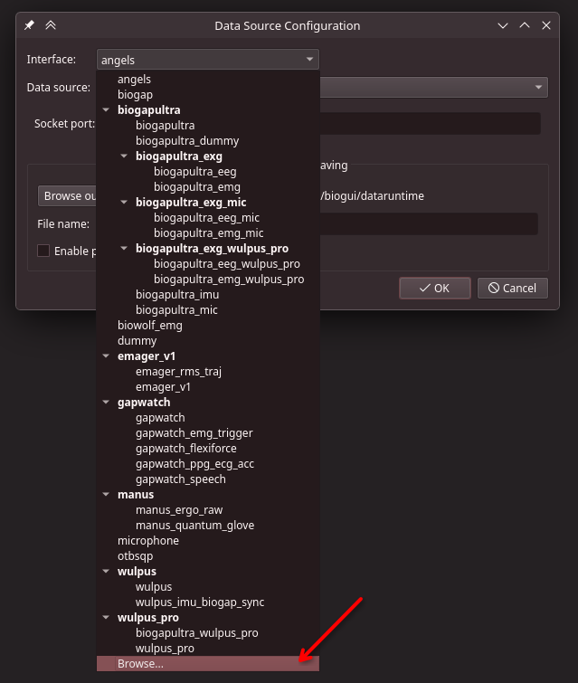
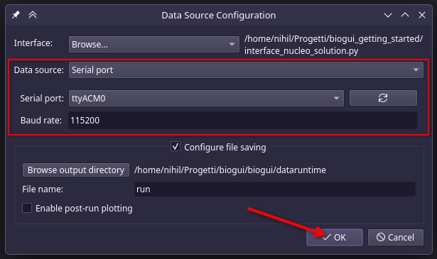
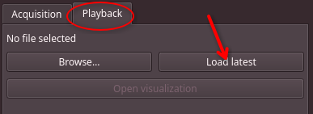

# biogui_getting_started
Repository for BioGUI workshop at EMBC 2026.

## 0. Preliminary information
For this workshop, we'll use a STM32F401RET6 NUCLEO board, paired with a X-NUCLEO-IKS01A2 sensor expansion board.
The board is configured to stream accelerometer and gyroscope data via UART.

## 1. Setup
First of all, download the BioGUI from GitHub:
```
git clone https://github.com/pulp-bio/biogui.git
```

Switch to the workshop branch:
```
git checkout workshop-embc-2026
```

Then, follow the [BioGUI's README.md](https://github.com/pulp-bio/biogui/blob/main/README.md) to configure the Python environment and launch the BioGUI. You can also check the documentation [here](https://pulp-bio.github.io/biogui/).

## 2. Interfacing with the device
The only step needed to acquire data from the device is to write an *interface file*. An interface file is a regular Python file with a set of predefined fields:
- `packetSize`: integer representing the number of bytes to be read; if the device sends multiple signals in different packets, one must provide a tuple (HEADER, PACKET_SIZE), where the HEADER identifies the signal and the PACKET_SIZE may vary across signals.
- `startSeq`: sequence of commands to start the device, expressed as a list of bytes; if the device has timing constraints, one can alternate bytes with float numbers, which are interpreted as delays (in seconds) by the BioGUI.
- `stopSeq`: sequence of commands to stop the device, expressed as a list of bytes; if the device has timing constraints, one can alternate bytes with float numbers, which are interpreted as delays (in seconds) by the BioGUI.
- `sigInfo`: dictionary containing, for each signal, a sub-dictionary with:
  - `fs`: sampling rate (float)
  - `nCh`: number of channels (int)
  - `extras`: dictionary containing additional configurations; must contain at least:
    - `type`: signal type, either `"ultrasound"` or `"time-series"` (string)
- `decodeFn`: function that decodes each packet of bytes read from the device into the specified signals.

Interface files for curated devices can be found in [`biogui/platforms`](https://github.com/pulp-bio/biogui/blob/main/biogui/platforms).

For the purpose of this workshop, we provide a skeleton for the interface file of the NUCLEO board: [`interface_nucleo.py`](https://github.com/pulp-bio/biogui_getting_started/blob/main/interface_nucleo.py).
If you can't wait, we also provide a complete version: [`interface_nucleo_solution.py`](https://github.com/pulp-bio/biogui_getting_started/blob/main/interface_nucleo_solution.py).

Once you think the interface file is ready:
1. plug the device;
2. click on "Add data source" -> "Interface" combo box -> "Browse";
3. select the interface file;
4. select "Data source" combo box -> "Serial port" (you can leave the baud rate at 115200, the default);
5. click "Ok", and follow the data source configuration wizard (you can leave everything at default);
6. click "Start streaming".





You should now be able to see the live signals. You can then stop the streaming by clicking on the "Stop streaming" button.

## 3. Visualizing the acquired signals
By default, the BioGUI stores the signals from each data source inside the `biogui/dataruntime` folder in binary format with the `.bio` extension (you can change the name and location when you add the data source).
By switching to the "Playback" tab, you can then browse .bio files or load the latest ones, and visualize the signals by clicking on "Open visualization".



## 4. Perform acquisition with triggers
The BioGUI