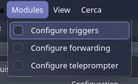
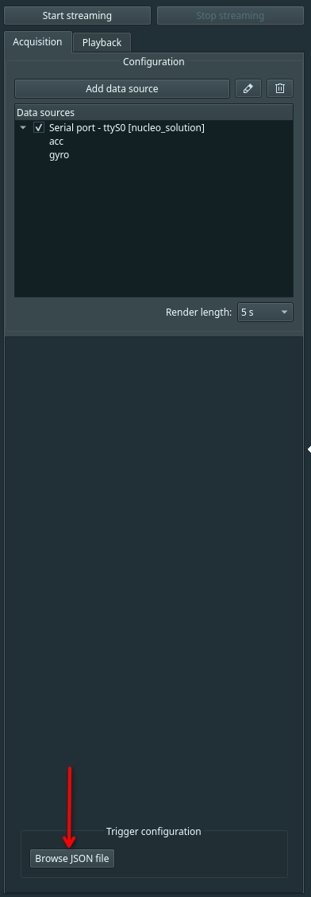
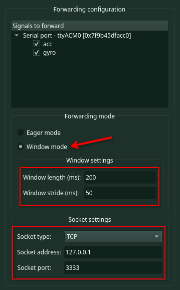

# biogui_getting_started
Repository for BioGUI workshop at EMBC 2026.

This project is licensed under Apache 2.0 (see LICENSE).
Some vendored components (STM32 HAL, CMSIS, middleware) retain their original licenses — see headers in respective folders.

## 0. Preliminary information
For this workshop, we'll use a STM32F401RET6 NUCLEO board, paired with a X-NUCLEO-IKS01A2 sensor expansion board.
The board is configured to stream accelerometer and gyroscope data via UART (the STM32Cube project lives in [`stm32-streamer`](https://github.com/pulp-bio/biogui_getting_started/blob/main/stm32-streamer)).

## 1. Setup
First of all, download the BioGUI from GitHub:
```bash
git clone https://github.com/pulp-bio/biogui.git
```

Switch to the workshop branch:
```bash
git checkout workshop-embc-2026
```

Then, follow the [BioGUI's README.md](https://github.com/pulp-bio/biogui/blob/main/README.md) to configure the Python environment and launch the BioGUI. You can also check the documentation [here](https://pulp-bio.github.io/biogui/).

Additionally, set up the environment for this repository:

```bash
python3 -m venv venv

source venv/bin/activate  # MacOS/Linux, or venv\Scripts\Activate.ps1 for Windows Powershell

pip3 install -r requirements.txt
```

## 2. Interfacing with the device
The only step needed to acquire data from the device is to write an *interface file*. An interface file is a regular Python file with a set of predefined fields:
- `packetSize`: integer representing the number of bytes to be read; if the device sends multiple signals in different packets, one must provide a tuple (HEADER, PACKET_SIZE), where the HEADER identifies the signal and the PACKET_SIZE may vary across signals.
- `startSeq`: sequence of commands to start the device, expressed as a list of bytes; if the device has timing constraints, one can alternate bytes with float numbers, which are interpreted as delays (in seconds) by the BioGUI.
- `stopSeq`: sequence of commands to stop the device, expressed as a list of bytes; if the device has timing constraints, one can alternate bytes with float numbers, which are interpreted as delays (in seconds) by the BioGUI.
- `sigInfo`: dictionary containing, for each signal, a sub-dictionary with:
  - `fs`: sampling rate (float)
  - `nCh`: number of channels (int)
  - `extras`: dictionary containing additional configurations; must contain at least:
    - `type`: signal type, either `"ultrasound"` or `"time-series"` (string)
- `decodeFn`: function that decodes each packet of bytes read from the device into the specified signals.

Interface files for curated devices can be found in [`biogui/platforms`](https://github.com/pulp-bio/biogui/blob/main/biogui/platforms).

For the purpose of this workshop, we provide a skeleton for the interface file of the NUCLEO board: [`interface_nucleo.py`](https://github.com/pulp-bio/biogui_getting_started/blob/main/biogui_utils/interface_nucleo.py).
If you can't wait, we also provide a complete version: [`interface_nucleo_solution.py`](https://github.com/pulp-bio/biogui_getting_started/blob/main/biogui_utils/interface_nucleo_solution.py).

Once you think the interface file is ready:
1. plug the device;
2. click on "Add data source" -> "Interface" combo box -> "Browse";
3. select the interface file;
4. select "Data source" combo box -> "Serial port" (you can leave the baud rate at 115200, the default);
5. click "Ok", and follow the data source configuration wizard:
    - it will show a configuration page for each signal declared in the interface file, providing options for filtering and plotting;
    - enable a 1st-order, 10Hz low-pass filter for the accelerometer.
6. click "Start streaming".


You should now be able to see the live signals. You can then stop the streaming by clicking on the "Stop streaming" button.

## 3. Visualizing the acquired signals
By default, the BioGUI stores the signals from each data source inside the `biogui/dataruntime` folder in binary format with the `.bio` extension (you can change the name and location when you add the data source).
By switching to the "Playback" tab, you can then browse .bio files or load the latest ones, and visualize the signals by clicking on "Open visualization".


## 4. Perform acquisition with triggers
The BioGUI features a trigger utility, allowing you to display visual stimuli for the subject during experiments. The trigger functionality is handled by the [Trigger module](https://pulp-bio.github.io/biogui/modules/trigger/), which can be enabled via the "Modules" menu.



Once enabled, a widget will appear on the bottom left.



You can then browse for a JSON file describing the trigger configuration. The JSON file must contain the following fields:
- `triggers`: dictionary mapping trigger labels to image filenames;
- `nReps`: number of repetitions for each trigger;
- `durationTrigger`: duration (in milliseconds) for which the stimulus is displayed;
- `durationStart`: initial delay (in milliseconds) before the first trigger;
- `durationRest`: duration (in milliseconds) of rest periods between triggers;
- `imageFolder`: path to the folder containing the stimulus images.

Image filenames and `imageFolder` can be empty strings: in that case, the BioGUI will show a warning, notifying that only textual stimuli will be shown.

For the purpose of this workshop, a JSON configuration is already provided: [`trigger_protocol.json`](https://github.com/pulp-bio/biogui_getting_started/blob/main/biogui_utils/trigger_protocol.json):
- it comprises 4 "gestures"—tilt right, tilt left, tilt forward, tilt backward;
- each gesture is repeated 4 times in an alternating way (i.e., right, left, forward, backward, right, etc.);
- each gesture lasts 5 seconds, with a 3-second rest period in between.

After selecting the JSON file with the trigger configuration, click on "Start streaming" to start the acquisition (**remember** to configure file saving in the data source configuration wizard). The experiment should last ~2 minutes.

## 5. Train a classification model
After acquiring the IMU data with triggers, open the [`Classify movements.ipynb`](https://github.com/pulp-bio/biogui_getting_started/blob/main/Classify%20movements.ipynb) Jupyter notebook and run it. In the notebook, you'll see:
- how to read the .bio file and preprocess the signals (in particular, we'll compute pitch and roll from accelerometer and gyroscope data);
- how to divide the signals in windows and build the dataset;
- how to train a machine learning model (a simple SVM classifier in this case) using a leave-one-repetition-out cross-validation scheme.

In each fold, we store the trained SVM model in SKOPS format: this will be useful for the next and last part of the workshop.

## 6. Run a PyGame task
The BioGUI can be seamlessly integrated into arbitrary pipelines thanks to the [Forwarding module](https://pulp-bio.github.io/biogui/modules/forwarding/), which can be enabled from the "Modules" menu (as for the Trigger module). Once enabled:
- it catches the acquired signal packets (**after** decoding and filtering);
- if in _window mode_:
    - it accumulates them in buffers;
    - once the buffer is full, it forwards the signals' windows via a TCP/Unix socket; 
    - window and step sizes can be configured;
- if in _eager mode_, it forwards the data as soon as it arrives.

Let's configure forwarding as follows:
- forward both `acc` and `gyro`;
- use _window mode_, with a window size of 200 ms and a step size of 50 ms;
- forward to a TCP socket on localhost (127.0.0.1) and port 3333.



Then, **before** starting the acquisition, let's launch the two Python scripts inside [`pygame_task`](https://github.com/pulp-bio/biogui_getting_started/blob/main/pygame_task):
- [`imu_middleware.py`](https://github.com/pulp-bio/biogui_getting_started/blob/main/pygame_task/imu_middleware.py), which receives data from the BioGUI, predicts the gesture using the trained SVM, and sends the prediction to the PyGame script:
```python
python3 pygame_task/imu_middleware.py --data_endpoint 127.0.0.1:3333 --cmd_endpoint 127.0.0.1:3334 --model_path models/YOUR_MODEL.skops --log
```
- [`run_fitts.py`](https://github.com/pulp-bio/biogui_getting_started/blob/main/pygame_task/run_fitts.py), that displays a PyGame-based Fitts' Law task in which the cursor is controlled via the commands received from the middleware:
```python
python3 pygame_task/run_fitts.py --endpoint 127.0.0.1:3334 --max_time 600
```